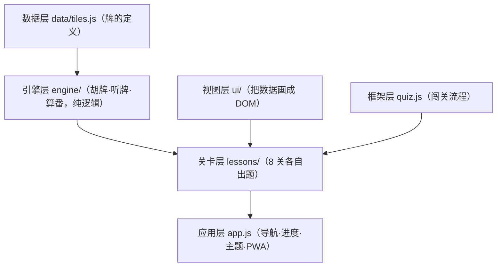
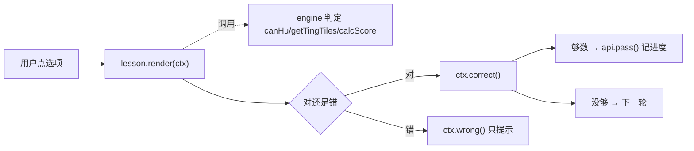
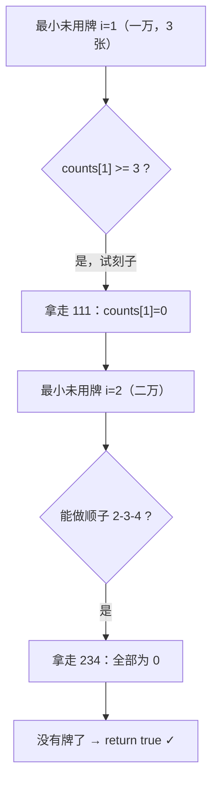

# 项目入门导览（零基础友好）

> 这份文档面向**完全没接触过前端 / JavaScript** 的同学。
> 目标：读完后你能看懂本项目每一行代码、能讲清它怎么运转、并能自己动手改。
>
> 阅读方式：第 1 章先补齐看代码需要的 JS 语法（每个语法点都配「最小例子 + 本项目用在哪」）；
> 第 2 章带你从数据到入口逐文件走读；第 3 章专门图解最难的「胡牌算法」；第 4 章教你动手加一关。
>
> 所有源码都在 `src/` 下。文中提到文件时给的是相对路径，例如 `src/js/engine/win.js`。

## 目录

- [0. 环境与启动](#0-环境与启动)
- [1. 看懂本项目需要的 JavaScript 语法](#1-看懂本项目需要的-javascript-语法)
- [2. 跟着代码读项目（逐文件走读）](#2-跟着代码读项目逐文件走读)
- [3. 胡牌算法专题（图解 + 手工推演）](#3-胡牌算法专题图解--手工推演)
- [4. 动手：新增第 9 关](#4-动手新增第-9-关)
- [5. 术语表](#5-术语表)
- [6. 学习路线建议](#6-学习路线建议)

---

## 0. 环境与启动

这是一个**纯前端**项目：没有后端、没有数据库、不需要编译，只有 HTML / CSS / JavaScript 三种文件。

但因为用到了「ES 模块」（见 1.1），浏览器要求必须通过 `http://` 访问，**不能直接双击 `index.html`**（那是 `file://`，模块会被浏览器拦截）。所以要起一个最简单的本地服务器：

```bash
# 在项目根目录执行（二选一）
python -m http.server 8123
# 或者（需要 Node）
npx serve .
```

然后浏览器打开 `http://localhost:8123/src/`。

另外有两段「测试」可以直接用 Node 跑（不需要浏览器），验证算法是否正确：

```bash
node tests/engine.test.mjs   # 胡牌/听牌/番型
node tests/gen.test.mjs      # 牌型生成器
```

---

## 1. 看懂本项目需要的 JavaScript 语法

JavaScript（简称 JS）是浏览器里运行的编程语言。下面按「本项目真正用到的」顺序讲，学完即可读懂全部源码。

### 1.1 `<script type="module">` 与 import / export

一个大程序会拆成很多 `.js` 文件，每个文件叫一个「模块」。模块之间用 `export`（导出）和 `import`（导入）互相调用。

```js
// a.js —— 导出
export function add(x, y) { return x + y; }   // 命名导出
export const PI = 3.14;
export default someThing;                      // 默认导出（一个文件最多一个）

// b.js —— 导入
import { add, PI } from './a.js';   // 按名字导入（要加花括号）
import lesson from './a.js';        // 导入默认导出（不要花括号，名字随便起）
import * as E from './a.js';        // 把 a.js 所有命名导出打包成对象 E，用 E.add
```

要点：
- 路径必须带后缀 `.js`，`./` 表示同目录，`../` 表示上一级目录。
- 浏览器里要让模块生效，HTML 必须写 `<script type="module" src="...">`。

**本项目用在哪：**
- 入口 HTML 用模块方式加载：
```17:17:src/index.html
    <script type="module" src="js/app.js"></script>
```
- 引擎统一出口把多个文件「转发」出去（`export *` = 把另一个模块的所有命名导出再导出一遍）：
```1:6:src/js/engine/index.js
/** 引擎统一出口。 */

export * from './hand.js';
export * from './win.js';
export * from './ting.js';
export * from './score.js';
```
- 每个关卡用「默认导出」导出一个对象：`export default { id, no, title, build() }`（见 `src/js/lessons/lesson-4-win.js`）。

### 1.2 变量：const 与 let

```js
const a = 1;   // 常量：不能再被重新赋值
let b = 2;     // 变量：可以改 b = 3
b = 3;         // OK
// a = 9;      // 报错
```

经验法则：**默认都用 `const`**，只有确实需要改的才用 `let`。
注意：`const arr = []` 后仍可 `arr.push(1)`——「不能重新赋值」指的是不能让 `arr` 指向另一个数组，但数组内容能变。

**本项目用在哪：** 几乎每行。例如计数器需要变就用 `let`：
```19:19:src/js/lessons/quiz.js
  let done = 0;
```

### 1.3 基本数据类型速览

- 数字：`42`、`3.14`
- 字符串：`'万'`、`"条"`
- 布尔：`true` / `false`
- 数组（有序列表）：`[1, 2, 3]`
- 对象（键值对）：`{ id: 5, name: '五万' }`
- `Set`（不重复集合）：`new Set([1, 2, 2])` → 里面只有 `1, 2`
- 特殊空值：`null`（空）、`undefined`（未定义）

本项目把「一张牌」用一个**数字**表示（如 `5` = 五万、`13` = 三筒），一手牌就是**数字数组** `[5, 5, 13, ...]`。

### 1.4 模板字符串（反引号）

用反引号 `` ` `` 包裹，里面可用 `${表达式}` 嵌入变量，能换行：

```js
const n = 3;
const s = `已答对 ${n} / 5`;   // "已答对 3 / 5"
```

**本项目用在哪：**
```24:24:src/js/lessons/quiz.js
  const update = () => (progress.textContent = `已答对 ${done} / ${target}`);
```

### 1.5 函数与箭头函数

普通函数声明：
```js
function add(x, y) {
  return x + y;
}
```

箭头函数（更短，常用于「临时小函数 / 回调」）：
```js
const add = (x, y) => x + y;     // 单表达式可省略 {} 和 return
const sq  = (x) => x * x;
const log = () => { console.log('hi'); };  // 多语句要加 {}
```

「回调函数」= 把一个函数当参数传给别人，让别人在合适时机调用它。

**本项目用在哪：**
```51:52:src/js/engine/hand.js
export function sortTiles(tiles) {
  return tiles.slice().sort((a, b) => a - b);
}
```
这里 `(a, b) => a - b` 就是传给 `sort` 的回调，告诉它怎么比较两个数。

### 1.6 数组的常用方法（重点）

数组方法是本项目的主力。下面每个都配一句话和项目出处。

| 方法 | 作用 | 例子 |
| --- | --- | --- |
| `forEach(fn)` | 遍历每个元素（不返回新数组） | `[1,2].forEach(x => console.log(x))` |
| `map(fn)` | 每个元素变换，返回**新数组** | `[1,2].map(x => x*2)` → `[2,4]` |
| `filter(fn)` | 留下「fn 返回 true」的元素 | `[1,2,3].filter(x => x>1)` → `[2,3]` |
| `some(fn)` | 是否**至少一个**满足 | `[1,2].some(x => x>1)` → `true` |
| `every(fn)` | 是否**全部**满足 | `[2,3].every(x => x>1)` → `true` |
| `reduce(fn, init)` | 把整个数组「累计」成一个值 | `[1,2,3].reduce((s,x)=>s+x, 0)` → `6` |
| `slice()` | 复制一段（不改原数组） | `[1,2,3].slice(0,2)` → `[1,2]` |
| `concat(x)` | 拼接，返回新数组 | `[1,2].concat(3)` → `[1,2,3]` |
| `includes(x)` | 是否包含某元素 | `[1,2].includes(2)` → `true` |
| `sort(fn)` | 排序（会改原数组，所以常先 `slice()`） | `[3,1].sort((a,b)=>a-b)` → `[1,3]` |
| `splice(i,n)` | 从下标 i 删除 n 个（会改原数组） | 见 `gen.js` 的 `pickN` |
| `fill(v)` | 用 v 填满 | `new Array(3).fill(0)` → `[0,0,0]` |

**项目出处举例：**
- `fill`：建计数数组 — `const counts = new Array(30).fill(0);`（`src/js/engine/hand.js`）
- `reduce`：番数求和 — `detail.reduce((sum, d) => sum + d.fan, 0)`（`src/js/engine/score.js`）
- `some`：龙七对判断 — `toCounts(tiles).some((c) => c === 4)`（`src/js/engine/win.js`）
- `every` / `filter`：对对胡判断 — `nonzero.slice(1).every((c) => c === 3)`（`src/js/engine/score.js`）
- `concat`：听牌「试摸一张」 — `tiles.concat(id)`（`src/js/engine/ting.js`）
- `includes`：实战关判断摸的牌对不对 — `winners.includes(info.id)`（`src/js/lessons/lesson-8-final.js`）

### 1.7 对象、解构、展开/剩余、默认参数

对象 = 一组「键: 值」：
```js
const tile = { id: 5, name: '五万' };
tile.id;        // 5（点取）
tile['name'];   // '五万'（方括号取）
```

解构 = 「拆包」，一次性把对象/数组里的值取出来变成变量：
```js
const { id, name } = tile;        // id=5, name='五万'
const [first, second] = [10, 20]; // first=10, second=20
```

函数参数也能解构，并给默认值：
```js
function f({ target, delay = 500 }) { /* delay 没传就用 500 */ }
f({ target: 4 });   // delay 自动是 500
```

展开 `...`（把数组/对象「摊开」）与剩余 `...`（把多余参数「收集」成数组）：
```js
const a = [1, 2];
const b = [...a, 3];          // 展开：[1,2,3]
const merged = { ...tile, x:9 }; // 展开对象：复制一份再加 x

function g(first, ...rest) {   // 剩余：rest 收集后面所有参数成数组
  // g(1,2,3) → first=1, rest=[2,3]
}
```

**本项目用在哪：**
- 参数解构 + 默认值：`createQuiz` 的第三个参数
```18:18:src/js/lessons/quiz.js
export function createQuiz(practiceEl, api, { target, delay = 500, render }) {
```
- 剩余参数：`el` 把后面所有子节点收进 `children`
```9:9:src/js/ui/dom.js
export function el(tag, props, ...children) {
```
- 展开：把 Set 变成数组存进 localStorage —— `JSON.stringify([...completed])`（`src/js/app.js`）。

### 1.8 条件判断与运算符

```js
if (x > 0) { ... } else { ... }

const y = (x > 0) ? '正' : '负';   // 三元运算符：条件 ? 真值 : 假值

a && b      // 与：a 真才看 b
a || b      // 或：a 假才看 b
a ?? b      // 空值合并：a 是 null/undefined 才用 b（0 和 '' 不算空）
obj?.prop   // 可选链：obj 是 null/undefined 时不报错，返回 undefined

===  // 严格相等（推荐，类型也要一样）
!==  // 严格不等
```

**本项目用在哪：**
- 三元：`canHu(tiles) ? '胡了' : '没胡'`（`src/js/lessons/lesson-4-win.js`）
- 空值合并：底分默认 1 —— `const base = options.base ?? 1;`（`src/js/engine/score.js`）
- 严格相等：`if (counts[i] === 0)`（`src/js/engine/win.js`）

### 1.9 循环

```js
for (let i = 0; i < 9; i++) { ... }     // 经典 for，i 从 0 到 8
for (const x of [10, 20]) { ... }        // for...of：依次拿到每个元素 x
while (条件) { ... }                      // 条件为真就一直循环
```

**本项目用在哪：**
- `for...of` 遍历计数数组找四张相同：`for (const c of counts) { ... }`（`src/js/engine/win.js`）
- 经典 `for` 遍历所有牌 id：`for (let id = 0; id < counts.length; id++)`（同上）

### 1.10 递归与回溯（重点，胡牌算法的核心）

**递归** = 函数自己调用自己，把大问题拆成同类的小问题。必须有「终止条件」，否则无限循环。

```js
// 阶乘 5! = 5×4×3×2×1
function factorial(n) {
  if (n <= 1) return 1;          // 终止条件
  return n * factorial(n - 1);   // 调用更小的自己
}
```

**回溯** = 在递归里「尝试一种选择 → 如果走不通，就撤销这次选择，换一种再试」。
撤销动作通常是「把刚改的数据复原」。

```js
// 伪代码：试着放一个东西，不行就拿回来
function tryPlace(state) {
  for (const choice of 所有可能) {
    apply(choice, state);          // 试
    if (tryPlace(state)) return true;
    undo(choice, state);           // 撤销（回溯）
  }
  return false;
}
```

**本项目用在哪：** 胡牌判定 `canAllMelds`（`src/js/engine/win.js`）就是典型递归+回溯——
试着把当前牌组成刻子，不行就「把 3 张牌加回去」，再试组成顺子。第 3 章会逐步推演。

### 1.11 闭包（重点，关卡框架的核心）

**闭包** = 函数「记住」了它被创建时所在环境里的变量，即使外层函数已经返回。
通俗说：内部的小函数能一直访问、修改外部函数里的局部变量。

```js
function makeCounter() {
  let n = 0;                 // 局部变量
  return () => { n += 1; return n; };  // 返回的函数“记住”了 n
}
const next = makeCounter();
next(); // 1
next(); // 2  ← n 被一直记着，没有被重置
```

**本项目用在哪：** `createQuiz` 里 `let done = 0;`（已答对数）被内部的 `correct()` 一直记着并累加，
这就是闭包，让每一关有自己独立的计数器而不用全局变量（`src/js/lessons/quiz.js`）。

### 1.12 操作网页：DOM

「DOM」= 浏览器把网页解析成的一棵「元素树」。JS 通过 DOM API 创建/查找/修改页面。

```js
const div = document.createElement('div');  // 造一个 <div>
div.textContent = '你好';                    // 设文字
div.className = 'card';                       // 设 class
div.dataset.id = 5;                          // 设 data-id="5" 自定义属性
div.classList.add('is-active');              // 加一个 class
parent.append(div);                          // 把 div 挂到父元素里
document.querySelector('.card');             // 按 CSS 选择器找第一个
document.getElementById('app');              // 按 id 找
```

**本项目用在哪：** 整个界面都是用 JS 动态生成的（没有写死在 HTML 里）。
核心是自制的 `el()` 函数（`src/js/ui/dom.js`），它内部就是 `createElement` + `className` + `append`。

### 1.13 事件（响应点击）

```js
button.addEventListener('click', () => {
  console.log('被点了');
});
```

`addEventListener('click', 回调)` = 「当这个元素被点击时，执行这个回调函数」。

**本项目用在哪：** `el()` 支持传 `onClick`，内部转成 `addEventListener`：
```28:29:src/js/ui/dom.js
      else if (k.startsWith('on') && typeof v === 'function') {
        node.addEventListener(k.slice(2).toLowerCase(), v);
```
所以 `el('button', { onClick: () => ... })` 就给按钮绑定了点击事件。

### 1.14 浏览器存储：localStorage

`localStorage` 是浏览器自带的「小仓库」，能把字符串存起来，关掉网页也还在。

```js
localStorage.setItem('key', '值');   // 存（只能存字符串）
localStorage.getItem('key');         // 取
```

存复杂数据要先用 `JSON.stringify` 转成字符串，取出来用 `JSON.parse` 还原：
```js
localStorage.setItem('arr', JSON.stringify([1, 2, 3]));
const arr = JSON.parse(localStorage.getItem('arr'));  // [1,2,3]
```

**本项目用在哪：** 保存通关进度（一个「已通关 id 的集合」）：
```39:41:src/js/app.js
function saveProgress() {
  localStorage.setItem(STORAGE_KEY, JSON.stringify([...completed]));
}
```

### 1.15 定时器：setTimeout

```js
setTimeout(() => { console.log('1 秒后执行'); }, 1000);  // 毫秒
```

**本项目用在哪：** 答对后稍等一下再出下一题（停顿感）：
```40:40:src/js/lessons/quiz.js
      else setTimeout(nextRound, delay);  // 否则下一轮
```

### 1.16 Service Worker 与 PWA（概念即可）

- **PWA**（渐进式网页应用）= 让网页能像 App 一样「安装到桌面、离线打开」。
- **Service Worker** = 一段在后台运行的脚本，能拦截网络请求、缓存文件，从而实现离线。

本项目用 `src/sw.js` 缓存所有资源，`src/js/app.js` 末尾负责「注册」它：
```213:216:src/js/app.js
if ('serviceWorker' in navigator && location.protocol.startsWith('http')) {
  window.addEventListener('load', () => {
    navigator.serviceWorker.register('./sw.js').catch(() => {});
  });
}
```
`'serviceWorker' in navigator` 是「特性检测」——先确认浏览器支持，再用，避免老浏览器报错。

---

## 2. 跟着代码读项目（逐文件走读）

### 2.1 全局架构与数据流

整个程序分五层，从下往上依赖：



一次「答题」的数据流：



下面按「数据 → 引擎 → 视图 → 框架 → 关卡 → 入口」的顺序走读。

### 2.2 数据层：src/data/tiles.js

这一层定义「牌长什么样」。关键约定：**用一个整数表示一张牌**。

```14:21:src/data/tiles.js
export const SUITS = [
  { key: 'wan',  name: '万', base: 0,  cpStart: 0x1f007 }, // 🀇 一万
  { key: 'tong', name: '筒', base: 10, cpStart: 0x1f019 }, // 🀙 一筒
  { key: 'tiao', name: '条', base: 20, cpStart: 0x1f010 }, // 🀐 一条(索)
];
```

- 三种花色各有一个 `base`（基数）：万=0、筒=10、条=20。
- 一张牌的 id = `base + 点数`。例如「五万」= 0+5 = `5`；「三筒」= 10+3 = `13`；「九条」= 20+9 = `29`。
- `cpStart` 是该花色第一张牌的 Unicode 码点，用来直接显示麻将字符 🀇🀙🀐。

`tileInfo(id)` 把一个数字 id 反查成完整信息（花色、点数、中文名、字符）：
```55:67:src/data/tiles.js
export function tileInfo(id) {
  const base = Math.floor(id / 10) * 10;
  const suit = SUITS.find((s) => s.base === base);
  const point = id - base;
  return {
    id,
    suit: suit.key,
    suitName: suit.name,
    point,
    label: `${CN_NUM[point]}${suit.name}`,
    glyph: String.fromCodePoint(suit.cpStart + point - 1),
  };
}
```
`Math.floor(id / 10) * 10` 是「向下取整到十位」：`13 → 10`、`29 → 20`、`5 → 0`，于是拿到花色基数。

### 2.3 引擎层：src/js/engine/hand.js（手牌工具）

这层是「纯逻辑」——只处理数字，不碰页面。`hand.js` 提供最基础的工具。

最重要的两个概念：
1. **牌 id 拆解**：
```19:26:src/js/engine/hand.js
export function suitBaseOf(id) {
  return Math.floor(id / 10) * 10;
}

/** 牌 id -> 点数（1-9）。 */
export function pointOf(id) {
  return id - suitBaseOf(id);
}
```
2. **计数数组**（核心数据结构）：把「一手牌」变成「每种牌各几张」。
```34:39:src/js/engine/hand.js
export function toCounts(tiles) {
  const counts = new Array(30).fill(0);
  for (const t of tiles) counts[t] += 1;
  return counts;
}
```
例：手牌 `[5, 5, 13]`（两张五万、一张三筒）→ `counts[5] = 2`、`counts[13] = 1`，其余为 0。
长度取 30 是因为最大牌 id 是 29（九条），下标 0/10/20 空着不用，正好当花色之间的「分隔」（后面算顺子时很关键）。

还有 `suitsPresent`（出现了哪几门花色）和 `suitCount`（几门），用于判断「缺一门」：
```56:64:src/js/engine/hand.js
export function suitsPresent(tiles) {
  const set = new Set();
  for (const t of tiles) set.add(suitBaseOf(t));
  return [...set].sort((a, b) => a - b);
}

export function suitCount(tiles) {
  return suitsPresent(tiles).length;
}
```
用 `Set` 自动去重：把每张牌的花色基数丢进去，最后集合大小就是「几门花色」。

### 2.4 引擎层：src/js/engine/win.js（胡牌判定，最难一块）

胡牌有两种合法结构：**标准型**（4 组面子 + 1 对将）和**七对型**。

#### 标准型：先定将，再递归拆面子

```52:67:src/js/engine/win.js
export function isStandardWin(tiles) {
  if (tiles.length % 3 !== 2) return false;
  const counts = toCounts(tiles);
  for (let id = 0; id < counts.length; id++) {
    if (counts[id] >= 2) {
      counts[id] -= 2;
      if (canAllMelds(counts)) {
        counts[id] += 2;
        return true;
      }
      counts[id] += 2;
    }
  }
  return false;
}
```
逐句解释：
- `tiles.length % 3 !== 2`：胡牌张数必是 `3×面子数 + 2(将)`，即除以 3 余 2（14 % 3 = 2）。不满足直接淘汰。
- 遍历每种牌，只要某种 `>= 2` 张，就**假设它是将**：`counts[id] -= 2` 先「拿走一对」。
- 调用 `canAllMelds` 看「剩下的牌能不能全部拆成面子」。
- 不管成不成功，都要 `counts[id] += 2` **把将放回去**（这就是回溯，保证下一次循环数据是干净的）。

#### 递归回溯：canAllMelds

```17:50:src/js/engine/win.js
function canAllMelds(counts) {
  let i = 0;
  while (i < counts.length && counts[i] === 0) i++;
  if (i >= counts.length) return true;

  // 尝试刻子
  if (counts[i] >= 3) {
    counts[i] -= 3;
    if (canAllMelds(counts)) {
      counts[i] += 3;
      return true;
    }
    counts[i] += 3;
  }

  // 尝试顺子（点数 1-7 起头，且同花色后两张存在）
  const point = pointOf(i);
  if (point <= 7 && counts[i + 1] > 0 && counts[i + 2] > 0) {
    counts[i] -= 1;
    counts[i + 1] -= 1;
    counts[i + 2] -= 1;
    if (canAllMelds(counts)) {
      counts[i] += 1;
      counts[i + 1] += 1;
      counts[i + 2] += 1;
      return true;
    }
    counts[i] += 1;
    counts[i + 1] += 1;
    counts[i + 2] += 1;
  }

  return false;
}
```
思路（贪心 + 回溯）：
1. 找到「还剩牌的最小 id」`i`（`while` 跳过所有为 0 的）。
2. 如果没有牌了（`i` 越界）→ 全拆完，成功 `return true`（递归终止条件）。
3. 这张最小的牌 `i` 必须被用掉，只有两种用法：
   - **当刻子**（3 张相同）：`counts[i] -= 3`，递归处理剩下的；不行就 `+= 3` 撤销。
   - **当顺子头**（i, i+1, i+2）：需要点数 ≤ 7（否则会跨花色，比如「八万九万十万」不存在），且后两张存在；试完不行也撤销。
4. 两种都走不通 → `return false`。

为什么「点数 ≤ 7」能防跨花色？因为九万 id=9、一筒 id=11，中间 id=10 永远是 0（分隔位），所以「九万+十+十一」这种顺子自然凑不出（`counts[10]` 是 0）。这正是计数数组留空 0/10/20 的妙处。

#### 七对型与「缺一门」

```70:77:src/js/engine/win.js
export function isSevenPairsLike(tiles) {
  if (tiles.length !== 14) return false;
  const counts = toCounts(tiles);
  for (const c of counts) {
    if (c !== 0 && c !== 2 && c !== 4) return false;
  }
  return true;
}
```
七对 = 14 张正好 7 对。只要每种牌的张数都是偶数（2 或 4）即可（4 张算两对，就是「龙七对」）。

```91:98:src/js/engine/win.js
export function hasQue(tiles) {
  return suitCount(tiles) <= 2;
}

/** 真正可胡：14 张 + 结构成立 + 缺一门。 */
export function canHu(tiles) {
  return tiles.length === 14 && isWinningShape(tiles) && hasQue(tiles);
}
```
`canHu` 是对外的总判断：**14 张** 且 **结构成立（标准或七对）** 且 **缺一门（花色 ≤ 2）**，三者缺一不可。
注意 `&&` 的「短路」特性：前面为假就不算后面，效率高也安全。

### 2.5 引擎层：src/js/engine/ting.js（听牌）

「听牌」= 现在差一张就能胡。算法非常直白：把 27 种牌每种都「试摸一张」，能胡的就是听的牌。

```15:25:src/js/engine/ting.js
export function getTingTiles(tiles) {
  if (tiles.length % 3 !== 1) return [];
  const counts = toCounts(tiles);
  const result = [];
  for (const id of ALL_TILE_IDS) {
    if (counts[id] >= 4) continue;
    const candidate = tiles.concat(id);
    if (canHu(candidate)) result.push(id);
  }
  return result;
}
```
- `tiles.length % 3 !== 1`：听牌时手里是 13 张（13 % 3 = 1），不满足直接返回空。
- `for...of ALL_TILE_IDS`：遍历全部 27 种牌。
- `if (counts[id] >= 4) continue;`：这种牌已有 4 张，不可能再摸到第 5 张，跳过。
- `tiles.concat(id)`：生成「13 + 1」张的新数组（`concat` 不改原数组），丢给 `canHu` 判断。
- 能胡就 `push` 进结果。

这就是「站在 `canHu` 之上做枚举」——不需要新算法，复用已有的判断即可。

### 2.6 引擎层：src/js/engine/score.js（番型与算分）

四川麻将「番数相加，得分 = 底分 × 2^番数」。核心设计是**原子番型相加**：每个番型只加自己那一份，组合自动成立。

```110:135:src/js/engine/score.js
  if (sevenPair) {
    detail.push({ name: '七对', fan: 2 });
    if (isDragonSevenPairs(tiles)) detail.push({ name: '龙七对', fan: 1 });
    if (isQingYiSe(tiles)) detail.push({ name: '清一色', fan: 2 });
  } else {
    const pp = isPengPengHu(tiles);
    if (pp) detail.push({ name: '对对胡', fan: 1 });
    if (isJiangDui(tiles)) detail.push({ name: '将对', fan: 3 });
    if (isQingYiSe(tiles)) detail.push({ name: '清一色', fan: 2 });
    if (isDuanYaoJiu(tiles)) detail.push({ name: '断幺九', fan: 1 });
    else if (isDaiYaoJiu(tiles)) detail.push({ name: '带幺九', fan: 1 });
    if (detail.length === 0) detail.push({ name: '平胡', fan: 0 });

    const gen = autoGen(tiles) + (options.gen || 0);
    if (gen > 0) detail.push({ name: `根 ×${gen}`, fan: gen });
  }
  // ...附加番（自摸/杠上花…）后：
  const fans = detail.reduce((sum, d) => sum + d.fan, 0);
  return { win: true, fans, score: base * 2 ** fans, base, detail };
```
- `detail` 是一个数组，每识别到一个番型就 `push` 一项 `{ name, fan }`。
- 例如「清七对」不用单独写：七对(2) + 清一色(2) 自动相加 = 4。
- 最后 `reduce` 把所有 `fan` 加起来得 `fans`，`base * 2 ** fans` 算分（`**` 是乘方，`2 ** 3` = 8）。

顺带看一个巧妙的判断——「对对胡」（4 刻子 + 1 将）：
```29:36:src/js/engine/score.js
export function isPengPengHu(tiles) {
  const nonzero = toCounts(tiles).filter((c) => c > 0).sort((a, b) => a - b);
  return (
    nonzero.length === 5 &&
    nonzero[0] === 2 &&
    nonzero.slice(1).every((c) => c === 3)
  );
}
```
对对胡的计数特征一定是「四个 3 + 一个 2」。代码把非零张数排序后，判断是不是 `[2,3,3,3,3]`：恰好 5 种牌、最小的是 2（将）、其余都是 3（刻子）。

### 2.7 视图层：src/js/ui/

这层把「数据」变成「能看见、能点的 DOM」。

#### dom.js：自制元素工厂 el()

```9:40:src/js/ui/dom.js
export function el(tag, props, ...children) {
  let cls = [];
  let id = '';
  const tagName = tag.replace(/[.#][^.#]+/g, (m) => {
    if (m[0] === '.') cls.push(m.slice(1));
    else id = m.slice(1);
    return '';
  });
  const node = document.createElement(tagName || 'div');
  if (cls.length) node.className = cls.join(' ');
  if (id) node.id = id;

  if (props != null && (typeof props === 'string' || props instanceof Node)) {
    children.unshift(props);
  } else if (props && typeof props === 'object') {
    for (const [k, v] of Object.entries(props)) {
      if (k === 'class') node.className = [...cls, v].join(' ');
      else if (k === 'html') node.innerHTML = v;
      else if (k === 'dataset') Object.assign(node.dataset, v);
      else if (k.startsWith('on') && typeof v === 'function') {
        node.addEventListener(k.slice(2).toLowerCase(), v);
      } else if (v === true) node.setAttribute(k, '');
      else if (v !== false && v != null) node.setAttribute(k, v);
    }
  }

  for (const c of children) {
    if (c == null || c === false) continue;
    node.append(c instanceof Node ? c : document.createTextNode(String(c)));
  }
  return node;
}
```
它让你用一行写出复杂元素，例如：
```js
el('button.choice-btn', { onClick: () => alert('hi') }, '点我')
// 等价于：创建 <button class="choice-btn">点我</button> 并绑定点击
```
内部做了三件事：
1. **解析标签**：用正则 `/[.#][^.#]+/g` 把 `'button.choice-btn'` 里的 `.choice-btn` 摘出来当 class（`#xxx` 当 id），剩下 `button` 当标签名。
2. **处理 props**：`onClick` 这种 `on` 开头的转成事件监听；`dataset` 设 data-* 属性；`html` 设 innerHTML；其余当普通属性。
3. **挂子节点**：把后面所有参数（字符串或元素）`append` 进去；字符串自动转成文本节点。

`clear(node)` 则是把一个元素的孩子全删空（换下一题时用）。

#### tile.js：把牌画出来

```14:35:src/js/ui/tile.js
export function tileEl(idOrInfo, opts = {}) {
  const info = typeof idOrInfo === 'number' ? tileInfo(idOrInfo) : idOrInfo;
  const classes = ['tile', SUIT_CLASS[info.suit]];
  if (opts.selected) classes.push('is-selected');
  if (opts.small) classes.push('is-small');
  if (opts.faceDown) classes.push('is-back');
  if (opts.onClick) classes.push('is-clickable');

  const node = el(
    'button.' + classes.join('.'),
    {
      type: 'button',
      dataset: { id: info.id, suit: info.suit, point: info.point },
      title: info.label,
      ...(opts.onClick ? { onClick: () => opts.onClick(info, node) } : {}),
    },
    el('span.tile-glyph', opts.faceDown ? TILE_BACK : info.glyph),
    opts.showLabel ? el('span.tile-label', info.label) : null
  );
  ...
}
```
- 传入数字或 `tileInfo` 对象都行（`typeof ... === 'number'` 判断）。
- 把花色变成 CSS class（`suit-wan` 等）控制颜色。
- `dataset` 把牌的 id/花色/点数写进 `data-*`，方便后续读取。
- `...(opts.onClick ? { onClick } : {})`：**条件式展开**——有 `onClick` 才加这个属性，否则展开一个空对象（什么都不加）。

### 2.8 框架层：src/js/lessons/quiz.js（闯关引擎）

这是全项目「最聪明」的一小段：把 8 关共用的流程（计数、过关、停顿、防连点）收敛到一个函数。

```18:49:src/js/lessons/quiz.js
export function createQuiz(practiceEl, api, { target, delay = 500, render }) {
  let done = 0;
  const progress = el('div.quiz-progress');
  const stage = el('div.quiz-stage');
  practiceEl.append(progress, stage);

  const update = () => (progress.textContent = `已答对 ${done} / ${target}`);

  function nextRound() {
    api.clearFeedback();
    clear(stage);
    render(ctx);
  }

  const ctx = {
    stage,
    correct(msg) {
      done += 1;
      update();
      clear(stage); // 立即清空，杜绝过渡期重复点击
      api.feedback(true, msg);
      if (done >= target) api.pass();
      else setTimeout(nextRound, delay);
    },
    wrong(msg) {
      api.feedback(false, msg);
    },
  };

  update();
  nextRound();
}
```
逐点理解：
- `let done = 0`：闭包变量，记录本关已答对几题。
- `ctx`（context，上下文）是交给关卡的「小遥控器」，有三样东西：
  - `ctx.stage`：一块「画布」，关卡把这一轮的题目画在上面。
  - `ctx.correct(msg)`：答对时调用——计数 +1、**立刻 `clear(stage)`**（移除所有按钮，这样过渡期间没法重复点，是个重要防 bug 设计）、显示成功反馈、够数就 `api.pass()` 过关、否则 `setTimeout` 停顿后出下一题。
  - `ctx.wrong(msg)`：答错只提示，不清空，让用户重试。
- `render(ctx)`：每关自己实现的「出一轮题」函数，框架在合适时机调用它。
- 这是「控制反转」：框架掌握流程，关卡只负责出题和判对错。

### 2.9 一关完整走读：src/js/lessons/lesson-4-win.js

```23:66:src/js/lessons/lesson-4-win.js
export default {
  id: 'win',
  no: 4,
  title: '怎样算胡',
  subtitle: '4 面子 + 1 将',
  intro: `...讲解 HTML...`,
  build(practiceEl, api) {
    createQuiz(practiceEl, api, {
      target: 4,
      delay: 700,
      render(ctx) {
        const tiles = makeCase();
        const answer = canHu(tiles) ? '胡了' : '没胡';

        const options = el('div.quiz-options');
        ['胡了', '没胡'].forEach((label) =>
          options.append(
            el(
              'button.choice-btn',
              {
                type: 'button',
                onClick: () =>
                  label === answer
                    ? ctx.correct('判断正确！' + reasonFor(tiles))
                    : ctx.wrong('判断错了。' + reasonFor(tiles)),
              },
              label
            )
          )
        );

        ctx.stage.append(
          el('h3.practice-title', '这手牌（14 张）胡了吗？'),
          el('div.hand-board', handEl(tiles, { small: true })),
          options
        );
      },
    });
  },
};
```
一关就是一个**对象**，有元信息（`id/no/title`）和一个 `build()` 方法。`build` 里调 `createQuiz`，在 `render(ctx)` 里：
1. `makeCase()` 随机造一手牌（可能能胡、可能是花猪、可能差牌）。
2. `const answer = canHu(tiles) ? '胡了' : '没胡'`——**直接问引擎要标准答案**。
3. 造「胡了 / 没胡」两个按钮，点击时和 `answer` 比较：对就 `ctx.correct`，错就 `ctx.wrong`。
4. 把牌和按钮 `append` 到 `ctx.stage`。

这清晰体现了「界面 ↔ 引擎」的解耦：界面只问「胡没胡」，完全不关心引擎内部怎么递归算的。

### 2.10 入口：src/js/app.js

`app.js` 是「总调度」，负责把所有东西串起来。关键三件事：

1. **装载某一关**：取出当前关卡对象，造一个 `api`，调用 `lesson.build(practiceEl, api)`。
```149:170:src/js/app.js
  const api = {
    feedbackEl,
    practiceEl,
    feedback(ok, msg) {
      showFeedback(feedbackEl, ok, msg);
    },
    clearFeedback() {
      clearFeedback(feedbackEl);
    },
    pass() {
      const wasNew = !completed.has(lesson.id);
      completed.add(lesson.id);
      saveProgress();
      ...
    },
  };
```
`api` 是「关卡与 app 的契约」：关卡只能通过这三个方法和 app 打交道（显示反馈、清反馈、过关）。这样关卡不需要知道 app 内部细节。

2. **进度持久化**：`completed` 是一个 `Set`（已通关 id 集合），`pass()` 里 `completed.add(lesson.id)` 后 `saveProgress()` 写进 localStorage。

3. **主题与 PWA**：`applyTheme` 切换深/浅色（往 `<html>` 加 `data-theme="dark"`），末尾注册 Service Worker 实现离线。

---

## 3. 胡牌算法专题（图解 + 手工推演）

我们手工跑一遍 `canAllMelds`，体会「贪心 + 回溯」。

例：某花色的牌是 **一万 一万 一万 二万 三万 四万**（6 张）。
计数数组（只看万）：`counts[1]=3, counts[2]=1, counts[3]=1, counts[4]=1`。



如果第一步「刻子」走不通（比如牌是 **一万 二万 三万 二万 三万 四万**，没有三张相同），算法会在 `counts[1] >= 3` 这步判否，转而尝试「顺子 1-2-3」，拿走后再处理剩下的 2-3-4，同样成功。这就是「换一种拆法」。

回溯发生在哪？看代码：每次 `counts[i] -= 3`（或顺子的 `-1 -1 -1`）后，如果递归 `return false`，就立刻 `counts[i] += 3`（或 `+1 +1 +1`）**把牌放回**，保证尝试另一种拆法时数据是原样。

完整 `canHu` 例子（14 张、两门、能胡）：
- 万：一万一万一万（刻）、七万八万九万（顺）、二万二万（将）
- 筒：一筒二筒三筒（顺）、九筒九筒九筒（刻）
- 合计 3+3+2+3+3 = 14 张，花色只有「万、筒」两门。
- `isStandardWin`：枚举到「二万」当将（`counts[2] -= 2`），剩下交给 `canAllMelds`，能全部拆成 4 个面子 → `true`。
- `hasQue`：花色 2 门 ≤ 2 → `true`。
- 所以 `canHu` = `true`。

把其中一张牌换成「一条」，花色变 3 门，`hasQue` 立刻为 `false`，`canHu` 返回 `false`——这就是「花猪不能胡」。

---

## 4. 动手：新增第 9 关

体会「框架 + 关卡」的威力——加一关只需写一个小文件并注册。

**第 1 步**：新建 `src/js/lessons/lesson-9-demo.js`：

```js
import { el } from '../ui/dom.js';
import { handEl } from '../ui/tile.js';
import { sortTiles } from '../engine/index.js';
import { makeWinningHand } from './gen.js';
import { createQuiz } from './quiz.js';

export default {
  id: 'demo',          // 唯一 id（进度用它记录）
  no: 9,
  title: '练习关',
  subtitle: '示例',
  intro: `<p>这是一个演示用的练习关。</p>`,
  build(practiceEl, api) {
    createQuiz(practiceEl, api, {
      target: 3,        // 答对 3 题过关
      delay: 500,
      render(ctx) {
        const tiles = sortTiles(makeWinningHand());  // 出题：一手能胡的牌
        const options = el('div.quiz-options');
        ['好牌', '烂牌'].forEach((label) =>
          options.append(
            el('button.choice-btn', {
              onClick: () =>
                label === '好牌'
                  ? ctx.correct('对，这是一手胡牌！')
                  : ctx.wrong('再看看，它其实能胡。'),
            }, label)
          )
        );
        ctx.stage.append(
          el('h3.practice-title', '这手牌算好牌吗？'),
          el('div.hand-board', handEl(tiles, { small: true })),
          options
        );
      },
    });
  },
};
```

**第 2 步**：在 `src/js/lessons/registry.js` 里注册它（import + 加进数组）：

```js
import l9 from './lesson-9-demo.js';
export const LESSONS = [l1, l2, l3, l4, l5, l6, l7, l8, l9];
```

**第 3 步**：刷新 `http://localhost:8123/src/`，导航里就多了「第 9 关」。
无需改 `app.js`、`quiz.js` 或任何引擎代码——这就是分层 + 框架带来的「可扩展」。

---

## 5. 术语表

**前端 / JS 术语**

| 术语 | 含义 |
| --- | --- |
| DOM | 浏览器把网页解析成的元素树；JS 通过它操作页面 |
| 模块（module） | 一个 `.js` 文件，用 import/export 互通 |
| 回调函数 | 作为参数传出去、由别人调用的函数 |
| 箭头函数 | `(x) => x+1` 这种简写函数 |
| 解构 | 从对象/数组里一次性取值赋给变量 |
| 闭包 | 函数记住了创建时所在环境的变量 |
| 递归 | 函数调用自己 |
| 回溯 | 递归中「试错→撤销→再试」 |
| 计数数组 | `counts[id]=张数`，把牌局压成统计 |
| localStorage | 浏览器本地存储（关页面也在） |
| Service Worker | 后台脚本，拦截请求做缓存（离线） |
| PWA | 能安装、可离线的网页应用 |

**麻将术语**

| 术语 | 含义 |
| --- | --- |
| 面子 | 顺子或刻子，胡牌需要 4 组 |
| 顺子 | 同花色连续三张，如 三万四万五万 |
| 刻子 | 相同三张，如 五条五条五条 |
| 将（眼） | 作对的两张相同牌 |
| 缺一门 | 胡牌时花色不能超过两门 |
| 花猪 | 结束时仍有三门牌，重罚 |
| 听牌 | 差一张即可胡 |
| 番 | 牌型分值，番越高得分越多（相加制） |

---

## 6. 学习路线建议

1. 先把第 1 章语法过一遍，不必背，知道「长这样、干什么用」即可。
2. 按 2.2 → 2.10 的顺序读源码，**边读边对照浏览器里的实际效果**。
3. 重点啃第 3 章的胡牌算法：自己拿张纸，按计数数组手动跑一遍 `canAllMelds`。
4. 完成第 4 章「新增一关」，亲手体会分层与框架。
5. 想再进阶，可尝试：给 `score.js` 加「天胡/地胡」展示、做一个独立的「算番计算器」页面、或给牌面换成 SVG 图。

读到这里，你已经具备看懂并改造整个项目的能力了。祝学习顺利！
